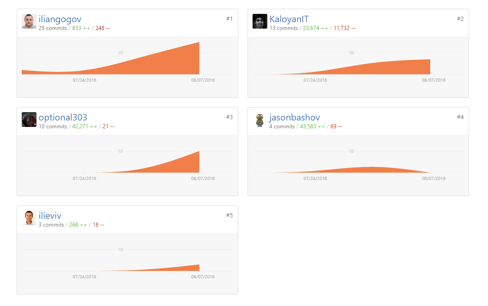
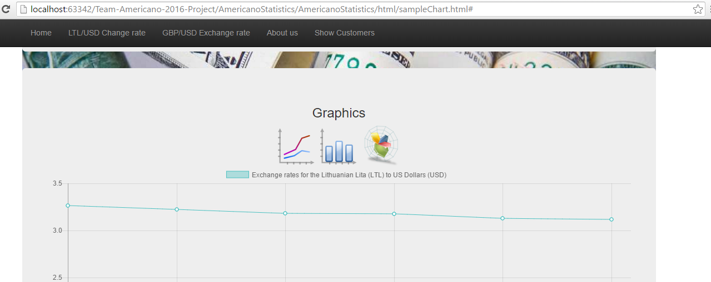
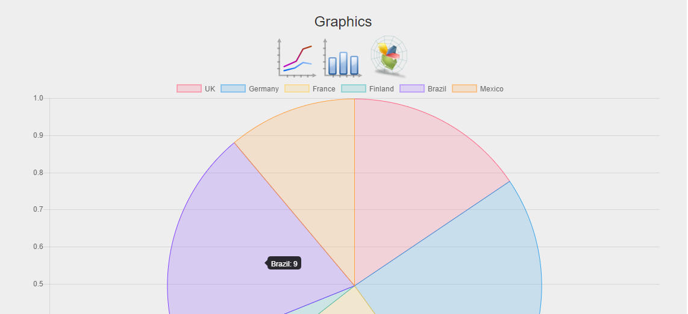
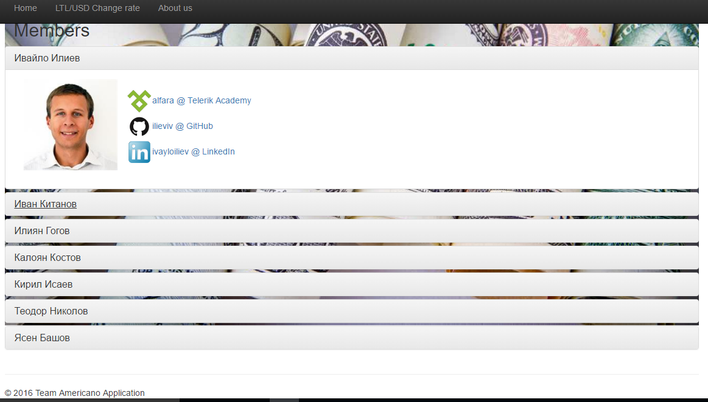

<!-- section start -->
<!-- attr: { class:'slide-title', showInPresentation:true, hasScriptWrapper:true } -->
# Team Americano

<!--  -->

	
JS UI&DOM TeamWork

	
Telerik Academy by Progress

	<a href="https://github.com/Team-Americano-2016/Team-Americano-2016-Project" class="signature-link">Link to the GitHub repository</a>

<!-- section start -->
<!-- attr: { showInPresentation:true, style:'font-size: 0.7em' } -->

# Team Americano Members

| Name | Academy | GitHub |
| :------------- | :------------------- | :--------------------------------------------|
| Илиян Гогов    | [Iliangogov](http://telerikacademy.com/Users/Iliangogov)  | [iliangogov](https://github.com/iliangogov)  |
| Иван Китанов   | [optional303](http://telerikacademy.com/Users/optional303)| [optional303](https://github.com/optional303)|
| Ивайло Илиев   | [alfara](http://telerikacademy.com/Users/alfara)          | [ilieviv](https://github.com/ilieviv)|
| Калоян Костов  | [RightWing](http://telerikacademy.com/Users/RightWing)    | [KaloyanIT](https://github.com/KaloyanIT)|
| Кирил Исаев    | [kissaev](http://telerikacademy.com/Users/kissaev)        | [issaev](https://github.com/issaev)         |
| Ясен Башов     | [triplexsa](http://telerikacademy.com/Users/triplexsa)    | [jasonbashov](https://github.com/jasonbashov)  |
|~~Теодор Николов~~| [TeodorNikolov](http://telerikacademy.com/Users/TeodorNikolov)| [TeodorNikolov](https://github.com/TeodorNikolov) |

<!-- section start -->
<!-- attr: { class:'slide-title', showInPresentation:true, hasScriptWrapper:true } -->

# GitHub graphics

<!--  -->

<!--  -->

<!-- section start -->
<!-- attr: { showInPresentation:true, style:'font-size: 0.7em' } -->

# Currency graphics drawing
   
What we do is reading data from json file.  
 - we take the currency rates changes from this file for a certain period of time  
 - we draw chartJS graphics based on this changes  
 - as additional functionality we made the option to switch graphic's type by clicking corresponding icon
 
 <!-- section start -->
<!-- attr: { showInPresentation:true, style:'font-size: 0.7em', hasScriptWrapper:true } -->

# Currency graphics Screenshot

<!--  -->

<!--  -->

<!-- section start -->
<!-- attr: { showInPresentation:true, style:'font-size: 0.7em' } -->

# Customers Section

What we do is reading data from json file.  
- we take some customer's details from this file  
- we draw chartJS graphics based on this person's details  
- as addition we made the option to switch graphic's type by clicking a button   
- as addition we made the option to filter customer by name in our json customer's file   
- we have option to show graphics based on customers Country's count  
- we have option to show graphics based on customers position's count   

<!-- section start -->
<!-- attr: { showInPresentation:true, style:'font-size: 0.7em', hasScriptWrapper:true } -->

#  Customers Section Screenshot

<!--  -->

<!--  -->

<!-- section start -->
<!-- attr: { showInPresentation:true, style:'font-size: 0.7em' } -->

# About Us Section

Here you can find a list of our team members.
- we use javascript and bootstrap to show our personal info in pretty way

<!-- section start -->
<!-- attr: { showInPresentation:true, style:'font-size: 0.7em', hasScriptWrapper:true } -->

# About Us Section Screenshot

<!--  -->

<!--  -->

<!-- section start -->
<!-- attr: { showInPresentation:true, style:'font-size: 0.7em', hasScriptWrapper:true } -->

#Home Section

Here we use pure canvas to make some animations "flying dollars"
